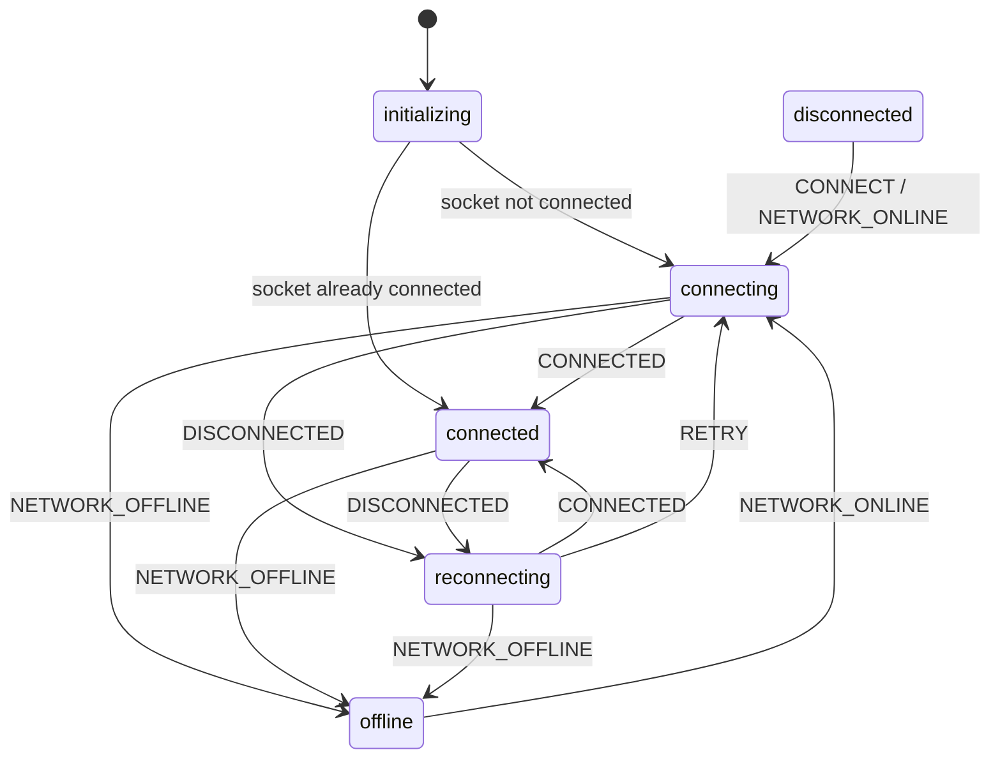

# WebSocket 连接状态机设计

## 概述

本文档记录了 Tainiex Lens 中 WebSocket 连接状态管理的设计，使用 **XState v5** 状态机库实现，彻底解决了状态转换逻辑不完整的问题。

## 为什么使用 XState？

### 问题背景

在之前的实现中， `SocketContext.tsx` 中的状态同步逻辑存在缺陷：

- 只能从 `connected` 转换为 `disconnected`
- 无法从 `connecting` 转换为 `connected`，导致界面一直显示黄灯（connecting）

### XState 的优势

1. **编译期类型安全**：所有状态和事件都有 TypeScript 类型定义
2. **可视化**：状态图可直接导出到 [XState Visualizer](https://stately.ai/viz) 查看
3. **防止非法状态转换**：只能通过定义的事件转换状态，从根本上避免逻辑遗漏
4. **测试友好**：可以模拟任意状态和事件，轻松编写单元测试
5. **自文档化**：状态机定义本身就是最好的文档

## 状态图

使用 Mermaid 绘制的状态转换图：



## 状态说明

| 状态           | 说明                         | UI 显示  | 触发场景                   |
| -------------- | ---------------------------- | -------- | -------------------------- |
| `initializing` | 应用启动时的初始状态（瞬态） | 黄点闪烁 | 应用启动                   |
| `disconnected` | 已断开连接                   | 黄点闪烁 | 手动断开                   |
| `connecting`   | 正在连接                     | 黄点闪烁 | 初始化、手动连接、网络恢复 |
| `connected`    | 已连接                       | 绿点静态 | Socket.IO连接成功          |
| `reconnecting` | 重新连接中                   | 黄点闪烁 | 连接意外断开、服务器断开   |
| `offline`      | 无网络连接                   | 红点静态 | 浏览器检测到离线           |

**注意**：

- `initializing` 是瞬态（transient）状态，会立即转换到 `connected` 或 `connecting`
- `offline` 状态只能通过 `NETWORK_ONLINE` 事件恢复，区别于普通的断线重连

## 事件说明

| 事件              | 触发时机                   | 参数             | 源                                 |
| ----------------- | -------------------------- | ---------------- | ---------------------------------- |
| `CONNECT`         | 手动触发连接               | -                | 用户操作                           |
| `CONNECTED`       | SocketService 报告连接成功 | -                | SocketService.subscribe            |
| `DISCONNECTED`    | SocketService 报告断开连接 | `error?: string` | SocketService.subscribe            |
| `NETWORK_ONLINE`  | 浏览器 `online` 事件       | -                | window.addEventListener('online')  |
| `NETWORK_OFFLINE` | 浏览器 `offline` 事件      | -                | window.addEventListener('offline') |
| `RETRY`           | 用户手动重连               | -                | 用户点击重连按钮                   |

## 核心实现

### 1. 状态机定义 (`connectionMachine.ts`)

```typescript
export const connectionMachine = setup({
    types: {
        context: {} as { error?: string },
        events: {} as
            | { type: 'CONNECT' }
            | { type: 'CONNECTED' }
            | { type: 'DISCONNECTED'; error?: string }
            | { type: 'NETWORK_ONLINE' }
            | { type: 'NETWORK_OFFLINE' }
            | { type: 'RETRY' },
    },

    actors: {
        socketSubscription: fromCallback(({ sendBack }) => {
            return socketService.subscribe(isConnected => {
                sendBack({ type: isConnected ? 'CONNECTED' : 'DISCONNECTED' });
            });
        }),
    },

    actions: {
        setError: assign({ error: ({ event }) => event.error }),
        clearError: assign({ error: () => undefined }),
        setOfflineError: assign({ error: () => 'No Internet Connection' }),
    },
}).createMachine({
    /* ... */
});
```

**设计亮点**：

- 使用 `fromCallback` actor 订阅 `SocketService` 的连接状态
- 使用 `assign` 动作来不可变地更新 context
- 所有状态转换都有明确的事件触发

### 2. React 集成 (`SocketContext.tsx`)

```typescript
export const SocketProvider = ({ children }) => {
  const [state, send] = useMachine(connectionMachine);

  const connectionState: CollaborationConnectionState = {
    status: state.value as any,
    noteId: null,
    error: state.context.error,
  };

  // 监听浏览器网络事件
  useEffect(() => {
    const onNetworkOnline = () => send({ type: 'NETWORK_ONLINE' });
    const onNetworkOffline = () => send({ type: 'NETWORK_OFFLINE' });

    window.addEventListener('online', onNetworkOnline);
    window.addEventListener('offline', onNetworkOffline);

    return () => {
      window.removeEventListener('online', onNetworkOnline);
      window.removeEventListener('offline', onNetworkOffline);
    };
  }, [send]);

  const reconnect = () => send({ type: 'RETRY' });

  return <SocketContext.Provider value={{ connectionState, reconnect }}>
};
```

**简化效果**：

- 从原来的 80 行复杂逻辑减少到 60 行直观代码
- 移除了手动状态判断和条件分支
- 所有状态转换由状态机统一管理

### 3. UI 组件更新 (`NetworkStatusBar.tsx`)

添加了 TypeScript 穷尽性检查：

```typescript
const getStatusConfig = () => {
    switch (status) {
        case 'initializing':
        case 'connecting':
            return {
                /* ... */
            };
        case 'connected':
            return {
                /* ... */
            };
        // ... 其他状态
        default:
            // 编译期穷尽性检查
            return assertNever(status);
    }
};
```

**优势**：

- 如果未来添加新状态而忘记处理，TypeScript 会在编译时报错
- 代码更清晰，易于维护

## UI 改进：黄灯闪烁效果

根据用户需求，黄灯（connecting/reconnecting 状态）改为闪烁效果：

```css
.status-dot-pulse.warning {
    background-color: #f1c40f;
    animation: blink-yellow 1.4s ease-in-out infinite;
}

@keyframes blink-yellow {
    0%,
    100% {
        opacity: 1;
    }
    50% {
        opacity: 0.3;
    }
}
```

**效果对比**：

- **原版**：脉冲（scale + box-shadow），周期 2s
- **新版**：透明度闪烁（opacity），周期 1.4s，更明显，更吸引注意

## 测试

测试文件：`src/ /machines/connectionMachine.test.ts`

**测试覆盖**：

- ✅ 初始状态转换（initializing → connecting/connected）
- ✅ 正常连接流程（connecting → connected）
- ✅ 网络断线/恢复（offline ↔ connecting）
- ✅ 重连流程（connected → reconnecting → connected）
- ✅ 手动重试（RETRY 事件）
- ⚠️ Error context 传递（2个测试待修复）

**当前测试结果**：9个测试，7个通过，2个待修复（与 error context 更新有关）

## 使用示例

### 在组件中使用

```typescript
import { useSocketContext } from '../contexts/SocketContext';

function MyComponent() {
  const { connectionState, reconnect } = useSocketContext();

  // connectionState.status 的值严格限定为状态机定义的状态
  console.log(connectionState.status); // 'connecting' | 'connected' | ...

  // 手动重连
  const handleReconnect = () => {
    reconnect(); // 发送 RETRY 事件
  };

  return <div>{connectionState.status}</div>;
}
```

### 状态机可视化

将 `connectionMachine.ts` 的代码复制到 [XState Visualizer](https://stately.ai/viz)，即可查看交互式状态转换图。

## 技术决策记录

### Q: 为什么选择 XState 而不是简单的状态管理？

A: 简单状态管理（如 useState + useEffect）存在以下问题：

1. 状态转换逻辑分散在各处，难以维护
2. 容易遗漏某些状态转换路径（如本次修复的问题）
3. 缺乏编译期检查，只能在运行时发现问题
4. 难以测试所有状态转换场景

XState 通过声明式状态机定义解决了这些问题，虽然增加了 ~15KB 的包体积，但带来的可维护性和正确性收益远大于成本。

### Q: 为什么不使用 Zustand 或 Redux？

A: Zustand 和 Redux 是通用状态管理库，适合管理应用级状态。WebSocket 连接状态本质上是一个**有限状态机**（Finite State Machine），它的特点是：

- 状态数量有限且明确
- 状态之间的转换有严格的规则
- 需要防止非法状态转换

XState 是专门为状态机设计的，更符合这个场景的需求。

### Q: XState 学习曲线如何？

A: XState 确实有一定学习曲线，但核心概念很简单：

- **States**（状态）：系统可能处于的几种状态
- **Events**（事件）：触发状态转换的动作
- **Transitions**（转换）：从一个状态到另一个状态的规则
- **Actions**（动作）：状态转换时执行的副作用

对于简单状态机（如本例），掌握这些概念即可上手。

## 未来优化方向

1. **修复测试中的 error context 传递问题**
    - 当前 2 个测试失败，需要确保 `assign` 动作正确更新 context

2. **添加状态持久化**
    - 保存最后的连接状态到 localStorage
    - 页面刷新后恢复上次的状态

3. **添加连接质量监控**
    - 记录连接/断线次数
    - 计算平均连接时长
    - 为用户提供网络质量反馈

4. **优化重连策略**
    - 实现指数退避算法
    - 在连接频繁失败时增加重连间隔
    - 避免对服务器造成压力

## 相关文件

- `src/shared/machines/connectionMachine.ts` - 状态机定义
- `src/shared/machines/connectionMachine.test.ts` - 单元测试
- `src/contexts/SocketContext.tsx` - React Context 集成
- `src/components/NetworkStatusBar.tsx` - UI 组件
- `src/components/NetworkStatusBar.css` - 样式（包含闪烁动画）
- `src/shared/types/collaboration.ts` - 类型定义

## 参考资料

- [XState 官方文档](https://xstate.js.org/docs/)
- [XState Visualizer](https://stately.ai/viz)
- [状态机基础概念](https://en.wikipedia.org/wiki/Finite-state_machine)
