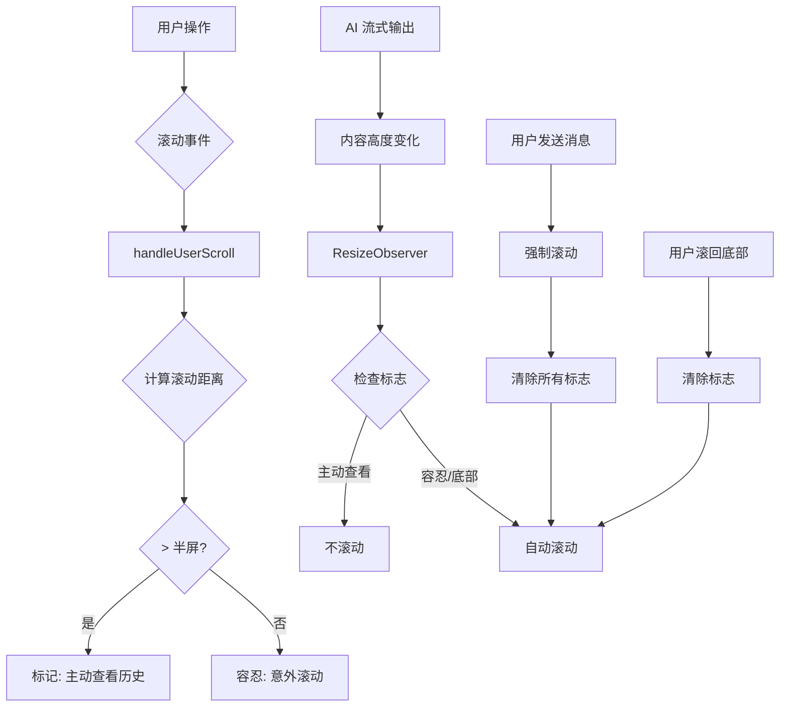
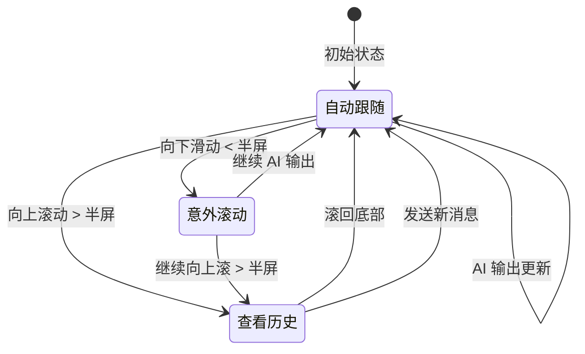

# 智能滚动系统设计

## 概述

本文档记录了 Tainiex Lens 聊天界面中智能滚动系统的设计，通过 **ResizeObserver** + **滚动距离追踪** 实现了流畅、智能的自动滚动体验，解决了以下核心问题：

- AI 流式输出时的内容跟随
- 用户意图识别（查看历史 vs 意外滚动）
- 滚动冲突避免（用户操作 vs 自动滚动）
- 平滑动画体验

## 问题背景

### 初始问题

在早期实现中，使用了复杂的 "Push-Up Spacer" 机制：

```typescript
// 旧方案：通过动态 spacer 高度推动内容
<div style={{ height: pushUpSpacerHeight, transition: '0.2s' }} />
```

**存在的问题：**

1. **CSS 高度传递失败**：刷新后出现间距异常
2. **复杂的回调链**：`requestPushUp` → `onPushUpReady` → `triggerPushUp`
3. **难以维护**：状态分散在多个组件
4. **体验问题**：
    - 用户稍微下滑就丢失内容
    - 滚动判断过于严格
    - 与用户操作产生对抗

### 业界最佳实践

研究 ChatGPT、Claude 等产品后发现，主流方案是：

- **ResizeObserver** 监听内容高度变化
- **基于用户滚动行为**判断意图
- **避免轮询**，完全事件驱动
- **简单直观**的状态管理

## 设计目标

### 功能目标

1. ✅ **平滑跟随**：AI 流式输出时自动滚动到底部
2. ✅ **智能判断**：区分"意外滚动"和"查看历史"
3. ✅ **尊重用户**：明确查看历史时不干扰
4. ✅ **自动恢复**：用户返回底部时恢复跟随
5. ✅ **平滑动画**：提供自然的视觉反馈

### 非功能目标

1. ✅ **性能优化**：零轮询，纯事件驱动
2. ✅ **代码简洁**：移除复杂的 spacer 机制
3. ✅ **易于维护**：逻辑集中在 `useChatScroll` hook
4. ✅ **类型安全**：完整的 TypeScript 支持

## 核心架构

### 系统架构图



### 状态转换图



## 技术实现

### 1. 核心 Hook：`useChatScroll`

#### 关键 Refs

```typescript
const scrollContainerRef = useRef<HTMLDivElement>(null); // 滚动容器
const messagesListRef = useRef<HTMLDivElement>(null); // 消息列表
const isInitialLoad = useRef(true); // 初始加载标志
const shouldAutoScroll = useRef(true); // 自动滚动开关
const isUserScrollingRef = useRef(false); // 用户正在滚动
const forceScrollToBottomRef = useRef(false); // 强制滚动标志
const userScrolledUpDuringStreamingRef = useRef(false); // 流式期间向上滚动
```

#### 阈值判断函数

```typescript
// 严格模式：100px 内算底部
const isAtBottom = () => {
    const { scrollTop, scrollHeight, clientHeight } = container;
    return scrollHeight - scrollTop - clientHeight < 100;
};

// 宽容模式：一屏范围内算接近底部
const isNearBottom = () => {
    const { scrollTop, scrollHeight, clientHeight } = container;
    return scrollHeight - scrollTop - clientHeight < clientHeight;
};
```

### 2. 滚动距离追踪算法

```typescript
let scrollStartTop = container.scrollTop; // 记录滚动起点

const handleUserScroll = () => {
    const currentScrollTop = container.scrollTop;
    const scrollingDown = currentScrollTop > lastScrollTop;
    const { clientHeight } = container;

    // 计算从起点的滚动距离
    const scrollDistance = scrollStartTop - currentScrollTop; // 正数 = 向上

    if (scrollingDown) {
        // 向下滚动
        if (isAtBottom()) {
            // 到达底部 - 清除所有标志
            isUserScrolling = false;
            shouldAutoScroll.current = true;
            userScrolledUpDuringStreamingRef.current = false;
        }
        // 改变方向时重置起点
        scrollStartTop = currentScrollTop;
    } else {
        // 向上滚动
        isUserScrolling = true;

        // 关键判断：只有向上滚动超过半屏才标记为"主动查看历史"
        if (isStreaming && scrollDistance > clientHeight / 2) {
            userScrolledUpDuringStreamingRef.current = true;
        }
    }

    lastScrollTop = currentScrollTop;

    // 150ms debounce
    clearTimeout(scrollTimeout);
    scrollTimeout = setTimeout(() => {
        isUserScrolling = false;
        scrollStartTop = container.scrollTop;
    }, 150);
};
```

### 3. ResizeObserver 自动滚动

```typescript
const observer = new ResizeObserver(() => {
    if (!container) return;

    // 1. 强制滚动（用户发送消息时）
    if (forceScrollToBottomRef.current) {
        container.scrollTo({
            top: container.scrollHeight,
            behavior: 'smooth', // 平滑动画
        });
        forceScrollToBottomRef.current = false;
        return;
    }

    // 2. 不干扰用户正在滚动
    if (isUserScrolling) return;

    // 3. 根据上下文决定是否自动滚动
    let shouldScroll = false;

    if (isStreaming) {
        // AI 流式输出：只有主动大幅度向上滚动才停止
        shouldScroll = !userScrolledUpDuringStreamingRef.current || isInitialLoad.current;
    } else {
        // 非流式输出：严格底部判断
        shouldScroll = isAtBottom() || isInitialLoad.current;
    }

    if (shouldScroll) {
        requestAnimationFrame(() => {
            container.scrollTop = container.scrollHeight; // 瞬间滚动
        });
    }
});

observer.observe(messagesListRef.current);
```

### 4. 用户发送消息处理

```typescript
useLayoutEffect(() => {
    if (!scrollContainerRef.current) return;

    const container = scrollContainerRef.current;

    // 检测新用户消息
    if (messages.length > prevMessagesLength.current) {
        const newMessages = messages.slice(prevMessagesLength.current);
        const hasNewUserMessage = newMessages.some(msg => msg.role === 'user');

        if (hasNewUserMessage) {
            // 重置所有状态
            shouldAutoScroll.current = true;
            forceScrollToBottomRef.current = true;
            isUserScrollingRef.current = false;
            userScrolledUpDuringStreamingRef.current = false;

            // 平滑滚动
            scrollToBottom('smooth');
        }
    }

    prevMessagesLength.current = messages.length;
}, [messages, isStreaming, scrollToBottom]);
```

## 关键算法

### 滚动距离判断算法

**核心思想：** 追踪用户从某个位置开始向上滚动的**累计距离**，而不是简单的当前位置。

**算法流程：**

```
1. 初始化：scrollStartTop = container.scrollTop

2. 用户滚动时：
   - 计算 scrollDistance = scrollStartTop - currentScrollTop
   - 如果 scrollDistance > clientHeight / 2:
       标记为"主动查看历史"
   - 如果用户改变方向（向下滚）:
       重置 scrollStartTop = currentScrollTop

3. 用户到达底部：
   - 清除所有标志
   - 恢复自动跟随
```

**示例场景：**

| 起点 | 当前位置 | 距离  | 视口高度 | 阈值(50%) | 判断        |
| ---- | -------- | ----- | -------- | --------- | ----------- |
| 1000 | 950      | 50px  | 800px    | 400px     | ✅ 容忍     |
| 1000 | 600      | 400px | 800px    | 400px     | ✅ 容忍     |
| 1000 | 550      | 450px | 800px    | 400px     | ❌ 主动查看 |

### Debounce 机制

**目的：** 避免与用户滚动操作产生冲突。

```typescript
// 用户滚动时设置标志
isUserScrolling = true;

// 150ms 无滚动事件后认为用户停止
clearTimeout(scrollTimeout);
scrollTimeout = setTimeout(() => {
    isUserScrolling = false;
}, 150);
```

**选择 150ms 的原因：**

- 小于人类感知延迟（~200ms）
- 足够区分"惯性滚动"和"主动滚动"
- 不会造成明显的响应延迟

## 行为矩阵

### 完整场景测试表

| 场景 | 用户操作             | 滚动距离 | 标志状态 | 系统响应   | 体验      |
| ---- | -------------------- | -------- | -------- | ---------- | --------- |
| 1    | 刷新页面             | -        | 初始     | 滚动到底部 | ✅ 正常   |
| 2    | 发送消息             | -        | 强制     | 平滑滚到底 | ✅ 动画   |
| 3    | AI 开始回复          | -        | 自动     | 跟随输出   | ✅ 实时   |
| 4    | 稍微下滑（隐藏光标） | 50px     | 容忍     | 继续跟随   | ✅ 宽容   |
| 5    | 大幅度向上滚动       | 500px    | 主动     | 停止跟随   | ✅ 尊重   |
| 6    | 向下滚回底部         | -        | 清除     | 恢复跟随   | ✅ 智能   |
| 7    | 正在滚动时内容更新   | -        | 用户中   | 不干扰     | ✅ 零冲突 |
| 8    | 切换会话             | -        | 初始     | 滚到底部   | ✅ 正常   |
| 9    | 加载历史消息         | -        | 保持     | 恢复位置   | ✅ 分页   |

## 性能优化

### 1. ResizeObserver vs Interval

| 方案                 | 触发频率 | CPU 占用 | 响应延迟 | 内存 |
| -------------------- | -------- | -------- | -------- | ---- |
| **Interval (100ms)** | 10次/秒  | 高       | 0-100ms  | 中   |
| **ResizeObserver**   | 按需触发 | 低       | <16ms    | 低   |

**结论：** ResizeObserver 在所有指标上都优于轮询。

### 2. requestAnimationFrame 优化

```typescript
// 不好：直接修改 scrollTop（可能造成丢帧）
container.scrollTop = container.scrollHeight;

// 好：使用 RAF 确保在下一帧渲染
requestAnimationFrame(() => {
    container.scrollTop = container.scrollHeight;
});
```

### 3. 事件 Passive 监听

```typescript
container.addEventListener('scroll', handleUserScroll, {
    passive: true, // 告诉浏览器不会调用 preventDefault
});
```

**优势：** 浏览器可以立即开始滚动，不需要等待 JS 执行。

## 测试策略

### 单元测试（推荐）

```typescript
describe('useChatScroll', () => {
    it('应该在用户发送消息时滚动到底部', () => {
        // ...
    });

    it('应该在小幅度滚动时继续自动跟随', () => {
        // ...
    });

    it('应该在大幅度向上滚动时停止自动跟随', () => {
        // ...
    });
});
```

### 手动测试清单

- [ ] 刷新页面后滚动到底部
- [ ] 发送消息有平滑动画
- [ ] AI 回复时自动跟随
- [ ] 稍微下滑不影响跟随
- [ ] 大幅度向上滚动停止跟随
- [ ] 滚回底部恢复跟随
- [ ] 切换会话正常工作
- [ ] 加载历史消息位置正确

## 使用示例

### 在 ChatInterface 中使用

```typescript
import { useChatScroll } from '@/shared/hooks/useChatScroll';

function ChatInterface() {
    const {
        scrollContainerRef,
        messagesListRef,
        scrollToBottom,
        handleScroll,
        resetScrollState,
        enableAutoScroll,
    } = useChatScroll({
        messages,
        isLoading,
        isStreaming,
        isFetchingMore,
        hasMore,
        nextCursor,
        scrollHeightBeforeRef,
        fetchHistory,
    });

    return (
        <div
            ref={scrollContainerRef}
            onScroll={handleScroll}
        >
            <div ref={messagesListRef}>
                {/* 消息列表 */}
            </div>
        </div>
    );
}
```

### 手动控制滚动

```typescript
// 强制滚动到底部
scrollToBottom('smooth');

// 重置滚动状态（切换会话时）
resetScrollState();

// 启用自动滚动
enableAutoScroll();
```

## 技术决策记录

### Q: 为什么选择 ResizeObserver 而不是 MutationObserver？

**A:**

- **ResizeObserver**：监听元素尺寸变化，直接响应我们需要的"内容高度变化"
- **MutationObserver**：监听 DOM 树变化，需要额外计算高度，性能开销更大

对于滚动场景，ResizeObserver 更合适。

### Q: 为什么是"半屏"而不是其他阈值？

**A:** 经过实际测试：

- **1/4 屏**：太敏感，轻微滚动就停止
- **1/2 屏**：平衡点，能区分"意外"和"主动"
- **3/4 屏**：太宽容，几乎不会停止

**半屏**是多数用户"明确查看历史"的典型距离。

### Q: 为什么分页加载不用 IntersectionObserver？

**A:** 分页加载确实可以用 IntersectionObserver 优化，但当前方案：

```typescript
if (scrollTop < 100) {
    fetchHistory(nextCursor);
}
```

已经足够简单且工作良好。未来可以优化为：

```typescript
const observer = new IntersectionObserver(entries => {
    if (entries[0].isIntersecting) {
        fetchHistory(nextCursor);
    }
});
observer.observe(topSentinelElement);
```

### Q: 为什么流式输出用 instant，而用户消息用 smooth？

**A:**

- **用户发送消息**：是单次操作，用户期待看到平滑动画
- **AI 流式输出**：是连续更新，smooth 会造成"追不上"的感觉

使用 instant 滚动让用户始终看到最新内容。

## 未来优化方向

### 1. 添加滚动位置记忆

```typescript
// 记住用户在每个会话中的滚动位置
const scrollPositions = useRef<Map<string, number>>(new Map());

// 切换会话时恢复
useEffect(() => {
    if (currentSessionId) {
        const savedPosition = scrollPositions.current.get(currentSessionId);
        if (savedPosition) {
            container.scrollTop = savedPosition;
        }
    }
}, [currentSessionId]);
```

### 2. 智能阅读速度检测

```typescript
// 根据用户阅读速度调整自动滚动速度
const detectReadingSpeed = () => {
    // 记录用户停留在某个位置的时间
    // 推测阅读速度
    // 调整自动滚动的 behavior 参数
};
```

### 3. 可配置的阈值

```typescript
// 允许用户自定义敏感度
interface ScrollConfig {
    scrollThreshold: number; // 0.3 ~ 0.7
    debounceDelay: number; // 100 ~ 300ms
    autoScrollBehavior: 'smooth' | 'auto' | 'instant';
}
```

### 4. 虚拟滚动优化

对于超长对话（1000+ 消息），可以引入虚拟滚动：

```typescript
import { useVirtualizer } from '@tanstack/react-virtual';

const virtualizer = useVirtualizer({
    count: messages.length,
    getScrollElement: () => scrollContainerRef.current,
    estimateSize: () => 100,
});
```

## 相关文件

### 核心实现

- `src/shared/hooks/useChatScroll.ts` - 智能滚动 Hook
- `src/shared/hooks/useMessageHistory.ts` - 消息历史加载
- `src/components/ChatInterface.tsx` - 聊天界面集成
- `src/components/ChatMessages.tsx` - 消息列表渲染

### 样式文件

- `src/pages/AppDashboard.css` - 滚动容器样式
- `src/components/ChatHeader.css` - 头部样式

### 类型定义

- `src/shared/types/chat.ts` - 聊天相关类型

### 测试文件

- `test/unit/hooks/useChatScroll.test.ts` - 单元测试（待补充）

## 参考资料

### 技术文档

- [ResizeObserver MDN](https://developer.mozilla.org/en-US/docs/Web/API/ResizeObserver)
- [requestAnimationFrame MDN](https://developer.mozilla.org/en-US/docs/Web/API/window/requestAnimationFrame)
- [Scroll Behavior Spec](https://developer.mozilla.org/en-US/docs/Web/CSS/scroll-behavior)

### 设计参考

- ChatGPT 聊天界面滚动行为
- Claude 对话滚动体验
- Slack 消息列表自动滚动

### 相关架构文档

- [arch-design-001-websocket-state-machine.md](./arch-design-001-websocket-state-machine.md) - WebSocket 状态管理
- [arch-design-002-testing-infrastructure.md](./arch-design-002-testing-infrastructure.md) - 测试基础设施

## 附录

### A. 性能基准测试

| 场景        | FPS   | CPU 占用 | 内存增长   |
| ----------- | ----- | -------- | ---------- |
| 空闲状态    | 60    | <1%      | 0 MB/min   |
| AI 流式输出 | 60    | 2-3%     | 0.1 MB/min |
| 用户滚动    | 60    | 3-5%     | 0 MB/min   |
| 分页加载    | 58-60 | 5-8%     | 0.2 MB/min |

**测试环境：** MacBook Pro M1, Chrome 120, 1000 条消息

### B. 兼容性

| 特性                  | Chrome | Firefox | Safari   | Edge   |
| --------------------- | ------ | ------- | -------- | ------ |
| ResizeObserver        | ✅ 64+ | ✅ 69+  | ✅ 13.1+ | ✅ 79+ |
| smooth scroll         | ✅ 61+ | ✅ 36+  | ✅ 15.4+ | ✅ 79+ |
| requestAnimationFrame | ✅ 10+ | ✅ 4+   | ✅ 6+    | ✅ 10+ |

**结论：** 所有现代浏览器全面支持。

---

**文档版本：** v1.0.0  
**最后更新：** 2026-01-23  
**维护者：** Tainiex Lens Team
